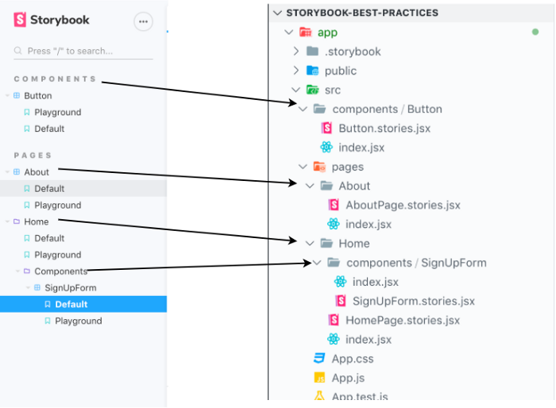

Este é um post sobre Storybok e convenções. Ele é baseado nas minhas experiências usando Storybook for muitos anos e a partir da experiência de outros desenvolvedores. As práticas que eu vou descrever aqui não são soluções prontas que vão concertar e melhorar todo e qualquer projeto. Elas são uma base de idéias e convenções que eu acredito valha a pena tentar. Espero, de verdade, que elas possam ajudar você e seu time a ter uma experiência de desenvolvimento melhor e que isso ajude a entregar software melhor às pessoas.

Eu presumo que você saiba o que é Storybook e que você tenha alguma experiência com ele. As idéias a seguir podem ser applicadas à aplicativos de qualquer tamanho e não são expecíficas de nenhum framework (por example, React, Vue, etc). Porém, eu escrevi elas tendo em mente um time grande com muitos desenvolvedores.

Eu vou usar o termo em Inglês "story" ao invés the história para evitar confusões. Story é a unidade básica do Storybook e normalmente serve para representar algum element visual com uma configuração específica.

## 1. Um Arquivo Storybook por Componente

Cada arquivo de Storybook deve ter:

- uma story Padrão (Default)
- uma story chamada Playground
- e outras storys, se necessário, que representem um estado específico do componente ou um uso específico de sua API (Application Programming Interface)

A story padrão mostra o componente com apenas as propriedades (props em React) obrigatórias. Isso ajuda a criar uma representação base para todos sobre a interface gráfica do componente e suas funções. Quando as pessoas pensarem sobre o componente, o ideal seria que elas associassem essa representação com o que a story padrão apresenta.
A story playground é usada para ajudar outras pessoas a testarem combinações diferentes de configurações do componente e ver como ele responde. Isso pode ser implementado na 5a. versão utilizando o knobs add-on. Você cria knobs para todas a propriedades que o componente aceite:

```jsx
import React from "react";
import {storiesOf} from "@storybook/react";
import { withKnobs, text } from '@storybook/addon-knobs';
import Button from ".";


const storiesOf("Button", module).
    addDecorator(withKnobs)
    add("Default", () => {
        return <Button type="button" text="Click me" />
    }).
    add("Playground", () => {
        const typePropLabel = 'type';
        const typePropOptions = {
            submit: 'submit',
            input: 'input'
        };
        const typePropDefaultValue = typePropOptions.submit;

        const textPropLabel = "text";
        const textDefaultValue = "Click me";

        return (
            <Button 
                type={select(typePropLabel, typePropOptions, typePropDefaultValue)} 
                text={text(textPropLabel, textDefaultValue)} 
            />
        )
    })
```

Para a última versão do Storybook, a story playground pode ser escrita usando o [novo recurso chamado Args](https://storybook.js.org/docs/react/writing-stories/args). E funciona assim:

```jsx
import React from "react";
import Button from ".";

// Args Setup
const Template = (args) => <Button {...args} />;

export const Playground = Template.bind({});

const buttonTypes = {
  SUBMIT: 'submit',
  INPUT: 'input'
}

Playground.args = {
  type: buttonTypes.INPUT,
  text: "Primary",
};

Playground.argTypes = {
  type: {
    control: {
      type: "select",
      options: [buttonTypes.INPUT, buttonTypes.SUBMIT]
    }
  },
  text: {
    control: "text"
  }
}

export const DefaultStory = () => <Button type="button" text="Click me" />;

DefaultStory.storyName = "Default";

export default {
  title: "Components/Button",
  component: DefaultStory,
};
```

Por fim, as outras storys devem representar um estado específico ou o uso de uma API do componente. Por exemplo, se você tiver um botão que tem uma propriedade chamada type e cujos valores possam ser: `primary`, `secondary` ou `error`. Então nós poderíamos ter as seguintes stories: `Button/Primary`, `Button/Secondary`, `Button/Tertiary`, and `Button/Error`. Os motivos para seguir esse padrão são:

- É mais fácil compartilhar links de components que claramente representam um estado ou API. O que pode ser muito útil para outros membros do time como designers e QA.
- Se o Storybook for usado com outras ferramentas de teste, como teste de snapshot ou teste de regressão visual (visual regression testing), cada story torna-se um test unitário (unit test). Se algum dos testes falhar, você vai saber qual e muito provavelmente o porquê exato da falha.
- Ao escrever stories que claramente expõe o funcionamento e possívels estados do componente, é mais provavel que outros usuários, e nós mesmos no futuro, tenhamos um idéia clara do que o componente é capaz de fazer e assim evitamos que configuracões e APIs fiquem escondidas pela ferramenta.

## 2. Co-locação: Arquivos Storybook devem estar junto com o component deles

Código que muda pelos mesmos motivos deve ser mantido junto. Nesse sentido, o arquivo Storybook para um dado componente irá muito provavelmente mudar também quando o componente mudar. Logo, mantenha-os juntos. E tem um outro motivo também, se a pasta do componente for movida para outro diretório no projeto ou até mesmo para outro projeto, será mais fácil de levar o arquivo Storybook junto e não perdê-lo pelo caminho.

## 3. Como nomear coisas

Crie os arquivos do Storybook seguindo o padrão `[ComponentName].stories.[js|jsx|tsx]`. Pra ser sincero, a parte mais importante é que você e o seu time concordem em como nomear os arquivos do Storybook e que todos sigam o acordo. Eu gosto de incluir o nome do componente no nome do arquivo porque fica mais fácil de achá-lo no editor de texto. Do contrário, eu acabaria tendo vários arquivos chamados `index.stories.tsx` e daí eu tenho de abrir cada um deles para saber qual o correto ou realizar uma busca no projeto todo.

## 4 Componentes novos têm de ter um arquivo Storybook

Isso ajuda a criar um acervo de componentes e, com isso, os benefícios de ter um. Se o seu time usar algum tipo the Pull Request checklist, Storybook pode ser um dos items para ser conferido antes de promover o código para o branch git principal.

### 5 Use o Component Story Format

[Component Story Format or CSF](https://storybook.js.org/docs/react/api/csf) é a maneira recomendada pelos criadores do Storybook para se escrever stories. É basicamente um conjunto de convenções a ser usado nos arquivos do Storybook. Ao invés de usar a API storiesOf, você simplesmente escreve funções JavaScript e exporta elas. Storybook vai converter as funções e o export padrão em stories. Uma grande vantagem do CSF é que o código fica mais limpo e fácil de ler. Ao invés de focar na API do Storybook, você foca no que seu código está fazendo.

### 6 Arquitete Stories como você arquiteta a base de dados

Quando você usa Storybook você deve ter uma idéia clara sobre como seu applicativo é organizado. Eu encontrei essa idéia através de [Loïc Goyet](https://dev.to/loicgoyet) nesse post fantástico: [How I manage to make my Storybook project the most efficient possible](https://dev.to/loicgoyet/how-i-manage-to-make-my-storybook-project-the-most-efficient-possible-2d8o). A idéia dele é de fazer com que o menu das stories seja um reflexo da localizacão das stories no applicativo.



Você vê como o menu no Storybook acima alinha com a estrutura de arquivos do applicativo?
Organizar os stories assim vai ajudar você a:

- Encontrar stories facilmente
- Entender como o código está organizado sem mesmo precisar abrir o projeto

Se você aplica o conceito de co-location no seu applicativo (manter coisas relacionadas juntas) a estrutura de pastas e arquivos te ajuda a dar uma idéia de como o app está organizado. Mas que isso não seja confundido com arquitetura. Estrutura de pastas e arquivos não é arquitetura.

### 7. Ambiente Consistente

Quando nós desenvolvemos em Storybook nós queremos desenvolver componentes em isolamento, mas é muito provável que ainda assim tenhamos que usar alguns recursos compartilhados com o applicativo, como images, dados, CSS, icones, traduções, etc. E isso é bom porque queremos ter certeza que os componentes vão funcionar da mesma maneira  quando são utilizados no contexto do aplicativo. Por exemplo, se uma biblioteca de traducão é usada, ela provavelmente pode ser utilizada com a mesma configuracão dentro do Storybook. Outro exemplo, se CSS de outras libraries é usado, ele deve ser incluido no Storybook porque assim podemos descrobrir se esse CSS vai ter alguma influência, e muito provavelmente sim, no nosso CSS. O objetivo é evitar surpresas quando integrar o componente no aplicativo.

## 8. Mantenha dados sobre controle

Se você perceber que você precisa dos mesmos dados em diferentes stories, pode ser uma boa idéia crir uma pasta de mocks e adicionar arquivos JavaScript que exportam funcões-fábrica (factory functions) que vão criar dados reutilizáveis. Vamos supor que nós temos um componente de avatar. Ele tem uma imagem do usuário, o nome, e um link para a página do perfil. E esse componente é usado em vários lugares. Nós poderíamos ter um arquivo chamado `mocks/user.js` que tem esse conteúdo:

```js
const getUser = (overrides = {}) => {
    const defaultValues = {
        username: "Some User",
        anchor: "@someuser",
        image: "https://webapp/static/images/someuser.png"
    };
    return Object.assign(defaultValues, overrides);
};
export default getUser;
```

Por que funcões fábrica? Para ter certeza de que nós temos um objeto novo toda vez. Se nós importássemos um objeto, seria possível acidentalmente modificar o objeto e causar resultados errados. Eu já vi isso acontecer. Nesse exemplo eu estou usando Object.assign, mas você pode user algo mais sofisticado que sabe como combinar listas (arrays) e objetos. [Lodash](https://lodash.com/docs/4.17.15#mergeWith) e [RamdaJS](https://ramdajs.com/docs/#merge) são exemplos - RamdaJS é muito boa!

## 9. Crie seu próprio Decorator e Add-ons (Quando necessário)

[Decorators](https://storybook.js.org/docs/react/writing-stories/decorators) são basicamente funções que envelopam outro código e dão a ele uma funcionalidade extra. Em Storybook, decorators podem ser aplicados individualmente às stories (chamados de Story Decorators), à todas as stories de um componente (chamados de Component Decorators), ou à todas as stories no projeto (chamados de Global Decorators). A base é essa:

```jsx
const myDecorator = (Story) => (
    <div>
        <Story />
    </div>
);
```

É comum em aplicativos React ter providers ao redor do applicativo ou de partes dele. Se você precisa, por exemplo, que seu código esteja dentro de um provider, usar um decorator é um jeito de resolver o problema. Um outro exemplo bem simples seria adicionar uma margem em algums componentes de forma que eles não encostem nas bordas, você poderia ter um decorator como esse:

```jsx
const withMargin = (Story) => (
    <div style={{ margin: '3em' }}>
        <Story/>
    </div>
);
```

[Add-ons](https://storybook.js.org/docs/react/api/addons) são extensões do Storybook que podem ajudar a configurar e extender Storybook de muitas formas refinadas. É um pouco mais trabalhoso desenvolver um add-on, mas não é difícil e você tem mais poder e flexibilidade.

## 10. Uso e a Manutençõão do Storybook é coisa séria

Storybook pode ajudar imensamente a desenvolver UIs (user interfaces) porque estimula você a focar na API (Application Programming Interface) do seu componente, o que vai ajudar você a ter componentes mais genéricos e enxutos. Componentes genéricos e enxutos são flexíveis e podem ser usados em contextos diferentes. No final das contas, você pode ter menos componentes se você tiver components que são flexíveis. Menos componentes significa menos código; menos código significa menos changes de bugs; menos changes de bugs significa usuários e desenvolvedores mais felizes. Então, cuide e mantenha Storybook funcionando e em boa-forma. Não deixe que stories quebrem e reorganize o código quando for necessário.
Na minha experiência, as coisas somente melhoram quando assumimos a responsabilidade por elas. Se não tem um grupo de pessoas responsável por cuidar do Storybook, é bem difícil de mantê-lo evoluindo e colher os benefícios que advém de seu uso. Todos são responsáveis por contribuir e seguir as convençõões de um time, mas pode ser bom definir alguém, ou um grupo de pessoas, como responsáveis por Storybook. O(s) responsável(eis) por Storybook deve fazer com que outras pessoas sigam as convenções definidas pelo time e ajudar a melhorar o uso do Storybook.

## Conclusão

Essas são algumas idéias que eu reuni depois de usar Storybook por cinco anos e a partir da experiência de outros desenvolvedores mais espertos do que eu. Eu espero, de verdade, que você tenha aprendido algo novo e está animado em tentar Storybook ou em melhorar o uso dele no seu time. Se você tiver alguma pergunta ou sugestão para fazer esse artigo melhor, comente no Twitter usando o link abaixo.

Valeu!

### Referências

- https://storybook.js.org/
- https://www.learnstorybook.com/
- https://dev.to/loicgoyet/how-i-manage-to-make-my-storybook-project-the-most-efficient-possible-2d8o
- https://blog.hichroma.com/the-delightful-storybook-workflow-b322b76fd07?gi=48bcfdd9231b
- https://www.learnstorybook.com/design-systems-for-developers/react/en/distribute/
- https://www.richsoni.com/posts/2019-01-29-storybook-architecture-audit/
- https://github.com/lauthieb/awesome-storybook
